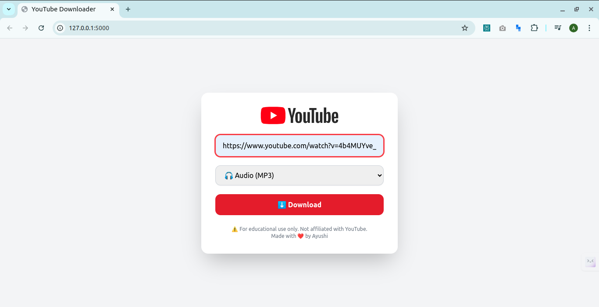

# YouTube Media Downloader 🎧🎥

This is a **personal project** I built to solve my own problem — I wanted a quick way to download YouTube videos or audio without relying on other sites.  
Through building this, I also learned how to deploy a Flask app and work with `yt-dlp`.

---

## 📌 What is it?

A simple **web application** where you can:
- Paste any YouTube video link
- Choose between **Audio (MP3)** or **Video (MP4)**
- Download it directly to your device

Works on both **desktop and mobile browsers**.

---

## 🛠 How it works

- **Frontend**: HTML + TailwindCSS for a clean, responsive UI
- **Backend**: Flask server to handle download requests
- **Downloader**: `yt-dlp` library for fast YouTube downloading
- **Media Processing**: Uses `ffmpeg` to merge or convert formats

---



## 🚀 How to Use

1. **Clone this repository**
    ```bash
    git clone https://github.com/<your-username>/youtube-media-downloader.git
    cd youtube-media-downloader
    ```

2. **Create a virtual environment & activate it**
    ```bash
    python3 -m venv venv
    source venv/bin/activate
    ```

3. **Install dependencies**
    ```bash
    pip install -r requirements.txt
    ```

4. **Install `ffmpeg` (required for merging audio/video)**
    ```bash
    sudo apt update
    sudo apt install ffmpeg
    ```

5. **Run the app**
    ```bash
    python app.py
    ```

6. **Open in browser**
    ```
    http://127.0.0.1:5000
    ```

7. **Paste a YouTube link → Select format → Download**

---

## 🌍 Deployment

I created this mainly to learn **how to deploy a backend app**.  
Possible free deployment options:
- [Render](https://render.com/)
- [Railway](https://railway.app/)
- [Replit](https://replit.com/)

---

## ⚠️ Disclaimer

This tool is for **educational purposes only**.  
Downloading YouTube videos may violate YouTube's Terms of Service — please use responsibly.

---

💡 **Why I built this:**  
I was facing issues downloading YouTube content in a way that works well on both mobile and desktop, so I created this for myself — and in the process, I learned about Flask, `yt-dlp`, file handling, and deployment.
